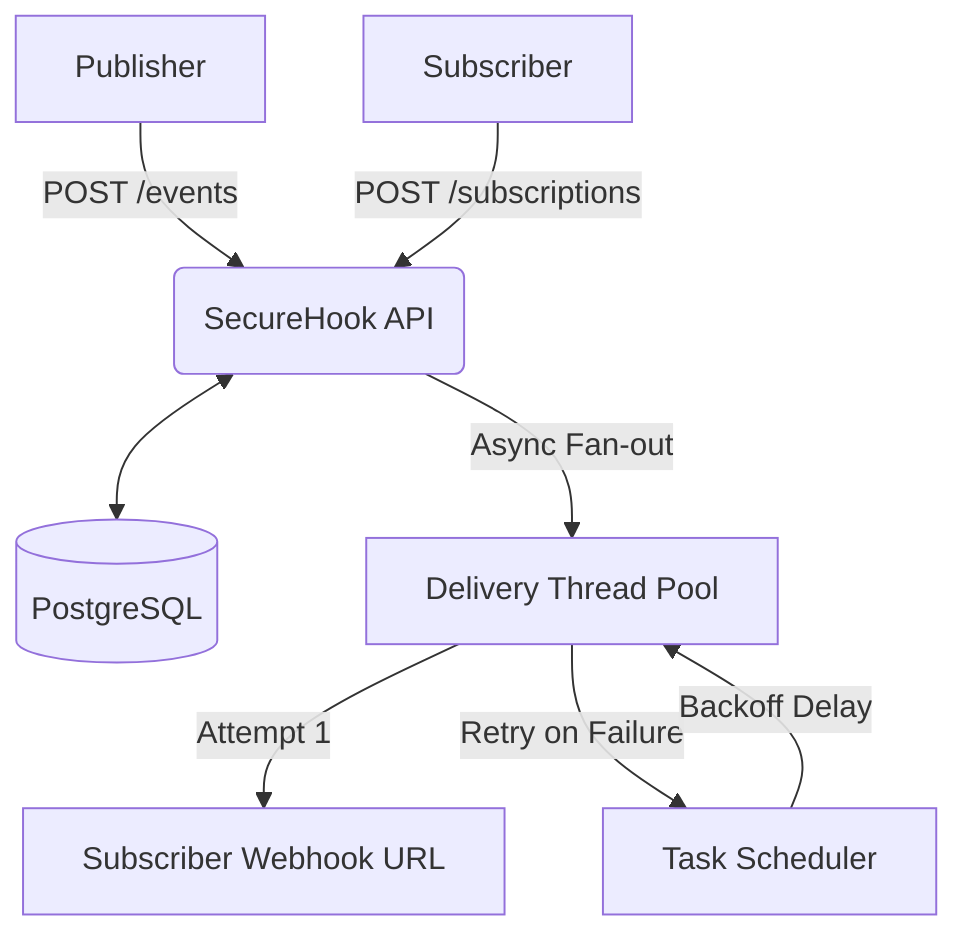

# SecureHook

SecureHook is a backend REST API that securely delivers webhooks to subscribers when specific events occur. It allows clients to subscribe to specific event types, and when an event is published, it performs an asynchronous fan-out delivery to all matching subscribers with cryptographic signatures and resilient retry mechanisms.

## How it works

1. **Subscribe:** Clients register their webhook URL and the event types they want to listen to (e.g., `order.created`). The system generates a cryptographically secure `secretKey` for that subscription.
2. **Publish:** An internal or external system publishes an event with a JSON payload to the `/events` endpoint.
3. **Fan-out Delivery:** The system finds all active subscriptions that match the event type and asynchronously dispatches a delivery task for each one.
4. **Signing:** Before sending, the payload is signed using HMAC-SHA256 and the subscription's `secretKey`. The signature is attached as the `X-Signature` HTTP header.
5. **Retry & Logging:** The system attempts delivery. Every attempt (success or failure) is recorded in an append-only delivery log. If delivery fails (network error or non-2xx HTTP status), it retries using exponential backoff for a total of 5 attempts (1 initial attempt plus 4 retries, with delays of 1s, 2s, 4s, and 8s).

## Architecture



## Tech Stack

*   **Java 17**
*   **Spring Boot 3.3.4** (Web, Data JPA, Validation)
*   **Supabase PostgreSQL** (Database)
*   **RestClient** (HTTP Client)

## Prerequisites and Setup

You need to set the following exact environment variables before running the application:

*   `DB_HOST`
*   `DB_PORT`
*   `DB_NAME`
*   `DB_USER`
*   `DB_PASSWORD`
*   `API_KEY` (The shared operator key to authenticate API requests)
*   `KEEPALIVE_URL` (Optional, set only in deployment to ping the health endpoint)
*   `KEEPALIVE_INTERVAL_MS` (Optional, defaults to 840000)

*Note on IPv4-only networks: When using Supabase from an IPv4 network, you must use the Supabase Session pooler (port 5432). The Transaction pooler (port 6543) is not suitable for JPA/Hibernate prepared statements.*

### How to generate an API key

You should generate a cryptographically secure 32-byte key. 

**PowerShell:**
```powershell
$rng=[Security.Cryptography.RandomNumberGenerator]::Create(); $bytes=New-Object byte[] 32; $rng.GetBytes($bytes); [Convert]::ToBase64String($bytes) -replace '\+','-' -replace '/','_' -replace '=',''
```

**cmd.exe:**
```cmd
powershell -Command "$rng=[Security.Cryptography.RandomNumberGenerator]::Create(); $bytes=New-Object byte[] 32; $rng.GetBytes($bytes); [Convert]::ToBase64String($bytes) -replace '\+','-' -replace '/','_' -replace '=',''"
```

**Git Bash:**
```bash
openssl rand -base64 32 | tr '+/' '-_' | tr -d '='
```

### Setting environment variables and running

**PowerShell:**
```powershell
$env:DB_HOST="your-db-host"
$env:DB_PORT="5432"
$env:DB_NAME="postgres"
$env:DB_USER="postgres.username"
$env:DB_PASSWORD="your-secure-password"
$env:API_KEY="your-generated-api-key"

.\mvnw.cmd clean spring-boot:run
```

**cmd.exe:**
```cmd
set DB_HOST=your-db-host
set DB_PORT=5432
set DB_NAME=postgres
set DB_USER=postgres.username
set DB_PASSWORD=your-secure-password
set API_KEY=your-generated-api-key

mvnw.cmd clean spring-boot:run
```

## API Reference

All endpoints except `/health` are protected and require the `X-API-Key` header.

| Method   | Path                       | Purpose                                      | Auth Required |
| -------- | -------------------------- | -------------------------------------------- | ------------- |
| `POST`   | `/subscriptions`           | Create a new webhook subscription            | Yes           |
| `GET`    | `/subscriptions`           | List all subscriptions (active and inactive) | Yes           |
| `DELETE` | `/subscriptions/{id}`      | Delete a subscription by its UUID            | Yes           |
| `POST`   | `/events`                  | Publish an event to be delivered             | Yes           |
| `GET`    | `/deliveries/{eventId}`    | Get the delivery attempt logs for an event   | Yes           |
| `GET`    | `/health`                  | Public health check endpoint                 | No            |

## Example Commands

The following examples use `curl.exe` and assume you have placeholder JSON files created (see the `examples/` directory). *Note: Be sure to replace the placeholder `targetUrl` in `examples/subscription.json` with your own webhook testing inbox URL (e.g., from webhook.site) before running the subscription creation example.*

**1. Create a Subscription (`201 Created`)**

*PowerShell:*
```powershell
curl.exe -s -i -X POST http://localhost:8080/subscriptions -H "Content-Type: application/json" -H "X-API-Key: $env:API_KEY" -d "@examples/subscription.json"
```
*cmd.exe:*
```cmd
curl.exe -s -i -X POST http://localhost:8080/subscriptions -H "Content-Type: application/json" -H "X-API-Key: %API_KEY%" -d "@examples/subscription.json"
```

**2. Invalid Subscription (Bad URL) (`400 Bad Request`)**

*PowerShell:*
```powershell
curl.exe -s -i -X POST http://localhost:8080/subscriptions -H "Content-Type: application/json" -H "X-API-Key: $env:API_KEY" -d "@examples/invalid_subscription.json"
```

**3. Publish an Event (`200 OK`)**

*PowerShell:*
```powershell
curl.exe -s -i -X POST http://localhost:8080/events -H "Content-Type: application/json" -H "X-API-Key: $env:API_KEY" -d "@examples/event.json"
```

**4. Publish an Invalid Event (`400 Bad Request`)**

*PowerShell:*
```powershell
curl.exe -s -i -X POST http://localhost:8080/events -H "Content-Type: application/json" -H "X-API-Key: $env:API_KEY" -d "@examples/invalid_event.json"
```

**5. Get Delivery Logs (`200 OK`)**
*(Replace `{eventId}` with the UUID returned from the Publish Event call)*

*PowerShell:*
```powershell
curl.exe -s -i -X GET http://localhost:8080/deliveries/{eventId} -H "X-API-Key: $env:API_KEY"
```

**6. Delete a Subscription (`204 No Content`)**
*(Replace `{subId}` with the UUID returned from the Create Subscription call)*

*PowerShell:*
```powershell
curl.exe -s -i -X DELETE http://localhost:8080/subscriptions/{subId} -H "X-API-Key: $env:API_KEY"
```

**7. Unauthorized missing/wrong key (`401 Unauthorized`)**

*PowerShell:*
```powershell
curl.exe -s -i -X GET http://localhost:8080/subscriptions -H "X-API-Key: WRONG-KEY"
```

**8. Not Found (`404 Not Found`)**

*PowerShell:*
```powershell
curl.exe -s -i -X DELETE http://localhost:8080/subscriptions/00000000-0000-0000-0000-000000000000 -H "X-API-Key: $env:API_KEY"
```

## Verifying Signatures

When SecureHook delivers an event to a subscriber's URL, it includes an `X-Signature` header (e.g., `sha256=abcdef123456...`). The receiving server should recompute the signature using its base64url-encoded `secretKey` and the exact raw HTTP request body, then perform a constant-time string comparison to verify authenticity.

**Python Example:**
```python
import hmac
import hashlib
import base64

def verify_signature(secret_key_b64: str, raw_body: bytes, received_signature: str) -> bool:
    # Pad base64url string properly
    secret_key_b64 += '=' * (-len(secret_key_b64) % 4)
    key = base64.urlsafe_b64decode(secret_key_b64)
    
    # Compute HMAC-SHA256
    expected_hmac = hmac.new(key, raw_body, hashlib.sha256).hexdigest()
    expected_signature = f"sha256={expected_hmac}"
    
    # Constant-time comparison
    return hmac.compare_digest(expected_signature, received_signature)
```

## Design Decisions

*   **Async Fan-out with Bounded Pool:** Event publishing (`POST /events`) is synchronous, but the actual HTTP delivery to subscribers happens asynchronously via a dedicated thread pool (`deliveryExecutor`). This prevents a slow subscriber from blocking the publisher or exhausting main web server threads, and the bounded pool prevents the system from running out of memory under heavy load.
*   **Exponential Backoff:** If a delivery fails, it is retried using exponential backoff. The system makes up to 5 attempts (1 initial, 4 retries) with delays of 1s, 2s, 4s, and 8s to give the subscriber's server time to recover without overwhelming it.
*   **HMAC Signing:** Payloads are signed with HMAC-SHA256 to ensure data integrity and authenticity. This prevents bad actors from spoofing events to subscribers.
*   **API Key Auth:** A single shared API key protects all endpoints (including read-only paths like `/deliveries`). This enforces a strict boundary for trusted service-to-service communication.
*   **Append-Only Delivery Log:** Every delivery attempt (success or failure) inserts a new row in the `delivery_attempts` table. We do not update existing rows. This creates a true, immutable audit trail for debugging.

## Testing

Integration tests (`SecureHookApplicationTests.contextLoads()`) run directly against a live Supabase PostgreSQL instance. Due to constraints in the development environment where Docker was unavailable, Testcontainers could not be used. Therefore, running `mvnw test` locally requires the exact same six environment variables (`DB_HOST`, `DB_PORT`, `DB_NAME`, `DB_USER`, `DB_PASSWORD`, `API_KEY`) to be set in order to verify context loading and database connectivity successfully.

## Known Limitations

*   **Azure App Service F1 Cold Starts:** The free F1 tier does not support "Always On." The application will idle out after about 20 minutes of inactivity. While the keep-alive scheduler reduces the frequency of cold starts, it does not completely eliminate them (e.g., a platform restart will still cause one). The first request after idling can take 30-60+ seconds to process.
*   **No SSRF Protection on `targetUrl`:** An authenticated caller can create a subscription targeting internal IP addresses or private network services.
*   **Thread Pool Saturation:** When the async delivery thread pool is fully saturated, it uses the `CallerRunsPolicy`. This causes the `/events` endpoint to block the caller instead of returning immediately.
*   **Static `secretKey`:** A subscription's `secretKey` is shown only once at creation and cannot be rotated.
*   **In-Process Retries:** Retries are scheduled in memory using Spring's `TaskScheduler`. If the application restarts, any pending retry attempts will be lost.
*   **No Subscriber Deactivation:** Subscriptions remain active indefinitely, even if their endpoints continuously fail to receive events.
*   **No Rate Limiting:** The `/events` endpoint currently has no rate limiting implemented.
*   **Single Shared API Key:** The system relies on one global API key for management access rather than per-client tokens.

## Live Demo

[Placeholder: Live Demo URL will be added here after deployment]